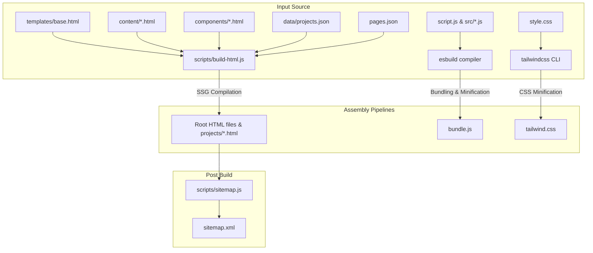

# Portfolio Architecture & Directory Structure

This document outlines the codebase layout, component model, and static build lifecycle of the Lay Shah Portfolio project.

---

## Directory Mapping

The codebase is structured to cleanly separate build templates, static content fragments, client-side scripts, and build outputs.

```
portfolio/
├── components/                  # Shared HTML fragments
│   ├── header.html              # Global navigation bar
│   └── footer.html              # Global page footer
├── content/                     # Page body fragments (HTML main body markup)
│   ├── index.html               # Homepage content
│   ├── blog.html                # Blog post list
│   ├── blog-*.html              # Individual blog post articles
│   └── projects.html            # Standalone project listing portal
├── data/                        # Static JSON data files
│   └── projects.json            # Contains array of all 7 project case studies
├── templates/                   # Main page layouts
│   ├── base.html                # Main boilerplate layout shell
│   └── project-case-study.html  # Project case study body layout
├── scripts/                     # Build tools and helpers
│   ├── build-html.js            # SSG assembler (Cheerio page compiler)
│   ├── copy-lucide.js           # Post-install asset copier
│   ├── generate-responsive-images.js # Responsive image optimizer (using sharp)
│   ├── seo.js                   # Deprecated SEO patching utility
│   └── sitemap.js               # XML sitemap generator
├── src/                         # Modulized client-side JS logic
│   ├── animations.js            # Scroll reveal and magnetic interactions
│   ├── api.js                   # Network request module (AJAX forms)
│   ├── components.js            # Pagination & custom DOM logic
│   ├── nav.js                   # Mobile menu toggles & active links
│   ├── theme-init.js            # Blocking theme init script (FOUC prevention)
│   ├── theme.js                 # Theme toggle operations
│   └── utils.js                 # Helper utilities (debounce/throttle)
├── projects/                    # Generated project pages (Build Output)
│   └── *.html                   # 7 individual project case study HTMLs
├── package.json                 # Dependency and task orchestration config
├── pages.json                   # SEO and layout configurations mapping
├── script.js                    # Javascript main entry point
├── style.css                    # Tailwind CSS main inputs file
├── tailwind.config.js           # Tailwind compiler directives configuration
├── tailwind.css                 # Compiled, minified CSS output (Build Output)
└── bundle.js                    # Bundled, minified JS output (Build Output)
```

---

## Build Lifecycles & Flows

The project compiles HTML, bundles JS, and minifies CSS through individual pipelines. 



### 1. HTML Assembly (SSG)
The assembler (`scripts/build-html.js`) reads page metadata from `pages.json` to configure titles, descriptions, canonical references, OpenGraph tags, and structured schemas.
- **Root Pages**: Assembles pages like `index.html` by injecting the `content/index.html` body fragment, replacing placeholders like `{{NAV_CONTENT}}`, `{{FOOTER_CONTENT}}`, and `{{HOMEPAGE_PROJECTS}}`.
- **Project Case Studies**: Reads the 7 project items inside `data/projects.json`. For each project, it maps properties into `templates/project-case-study.html` to generate fully statically-rendered HTML pages under the `projects/` subdirectory.

### 2. Stylesheet Generation
The Tailwind compiler processes `style.css` (which contains default variable themes, animations, and Tailwind directives) and writes the minified CSS directly to `tailwind.css`.

### 3. Client Script Bundling
The javascript bundler (`esbuild`) takes `script.js` as its entry point, resolves all modular imports inside `src/` statically, bundles them, tree-shakes dead code, minifies the result, and writes the output payload to `bundle.js`.

---

## Routing & URL Structure

URLs are structured to be clean, indexable, and free of dynamic queries.

- **Homepage**: `/index.html` (Canonical: `https://layshahdev.com`)
- **Projects Portal**: `/projects.html`
- **Blog Listing**: `/blog.html`
- **Blog Articles**: `/blog-slug.html`
- **Project Case Studies**: `/projects/slug.html` (e.g. `/projects/ghermar-sons.html`)
- **XML Sitemap**: `/sitemap.xml`
